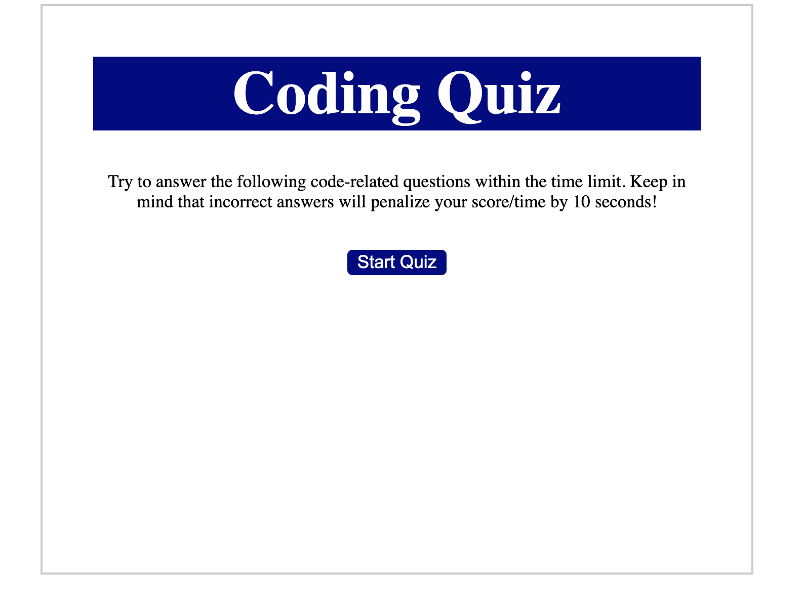

# Homework 04 - Code Quiz

## Link to site
* [Live Link](https://chronoslou.github.io/HW3/) - 
* [Repo README Link](https://chronoslou.github.io/HW3/) -

## Description

This program is a JavaScript (JS) based app that will quiz user on their knowledge of Javascript. This is a multiple choice timed quiz. 

## Usage

The app will should perfom the following logic:

* Quiz will be timed for 90 seconds
* Quiz will store high scores in a string and parse out the information. 
* The scores will be stored in a separate page
* Timer will star once the Start Button is clicked
* When a question is submitted, then you go to the next one
* If the option/choice selected is incorrect then, time is subtracted by 10 seconds

## Preview of App 

* This is how the app looks

   

